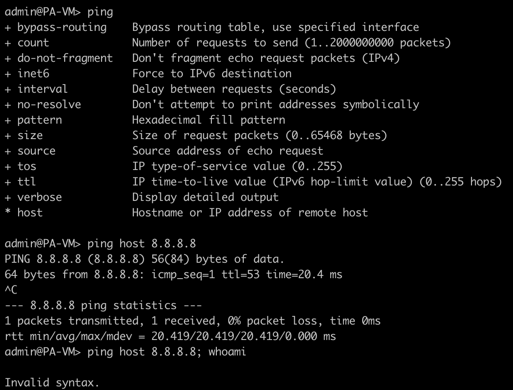
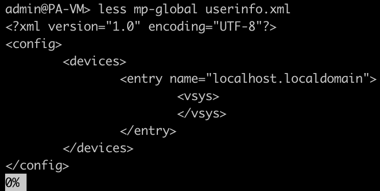
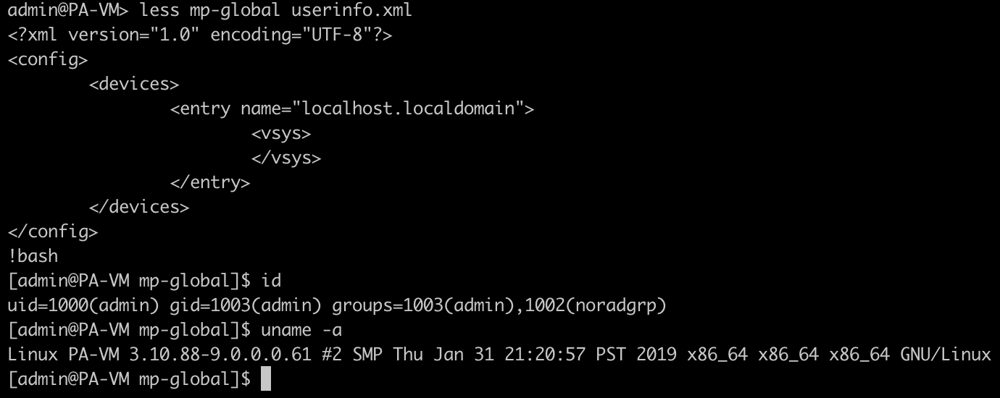
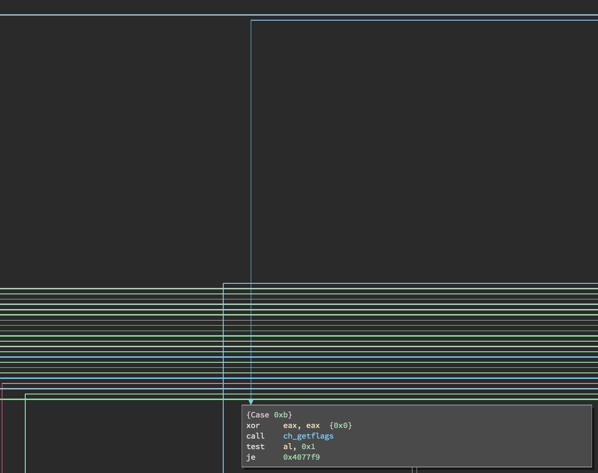
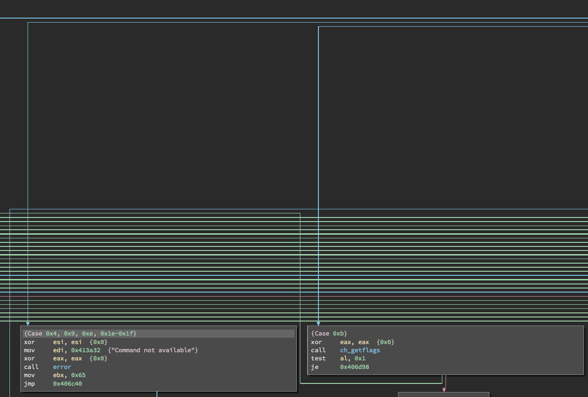

Earlier this year I was helping RIT’s [Collegiate Cyber Defense Competition](https://www.nationalccdc.org/) (CCDC) team prepare to compete at the national competition by looking into possible attack vectors that the red team would be using to exploit the team’s infrastructure and how to defend against those attacks.
[Nick O'Brien](https://github.com/cictrone) and I decided to look into the Palo Alto Networks virtual firewall product to find potential pain points for the team, as PAN has been a sponsor for the competition for the last few years and has frequently provided equipment and VMs to teams for use during the competition.
Firewalls are potent tools for defenders to use, and PAN-OS offers additional support for identifying the protocols used by traffic passing through it using deep packet inspection, which is excellent for identifying malicious traffic that doesn’t wrap its C2 traffic around an existing protocol.
While trying to figure out how the PA-VM appliance operates, I discovered a vulnerability in the CLI used to administer the firewall.
This blog post will explain a little bit about how the VM works, how the vulnerability can be triggered, and what steps PAN used to mitigate the vulnerability.

## PAN-OS overview

The PA-VM appliance is a virtualized version of the hardware firewall that PAN offers. The operating system running on the VM, PAN-OS, is operationally identical to the version running on the hardware appliance.
The OS uses a minimal version of CentOS 7, with restrictions that prevent the user from accessing the underlying Linux operating system. Console or SSH sessions use the CLI binary `/usr/local/bin/pan-cli` as a shell, which is how administrators configure the firewall.
Administrators are also able to configure the firewall using a web interface. Most of the default Linux utilities, like less, more, and vi remain on the filesystem but are mostly inaccessible from the command-line. This is all the information needed for this post, but I hope to eventually do a more in-depth analysis of the different components used within the PA-VM in a future blog post since it appears that there isn’t any public research into this space at this point.

## Vulnerability overview

Some commands within the CLI directly call their underlying Linux utilities to execute that command. For instance, the `ping` command uses the underlying executable to perform pings over the management interface of the appliance. The CLI sanitizes the input for this command and all other commands that I tested to prevent command injection.

However, some features of the less command were overlooked. The less utility is used to read files and ships with most versions of Linux. A command with the same name in the PAN-OS CLI is used to read debug files or logs and calls the `/usr/bin/less` binary to open the file.

Most editors or file browsers allow users to call other binaries directly from within them by typing an `!` with the command to run following it, including `less`.
This can allow a user to call the bash shell, escaping out of the PAN CLI.

This vulnerability [was given a 6.5 score on the CVSS 2.0 scale](https://nvd.nist.gov/vuln/detail/CVE-2019-1576) due to the need to authenticate to exploit it.

## Mitigation

Palo Alto Networks included a fix for this vulnerability with their 9.0.3 version update, which shipped in mid-July. Attempting to type an `!` in `less` returns a `Command not available (press RETURN)` error message, preventing command execution.
It appears that this error message is used on several other “commands” within less that would also result in either command execution or arbitrary reads of the filesystem.
Looking at the relevant portion of the control flow graph for the `less` binary in Binary Ninja, which is at address `0x406d60` in the patched version and address `0x4077d9` in the vulnerable version, we can see that a new flow has been added to the large switch statement used to respond to the various commands that can be issued from within `less`.
I had some trouble reversing this portion of the code, as this is a fairly complex switch statement, but I was able to figure out using the help text used when issuing the `:h` command within `less` that `:e`, `^X^V`, and `:v` are no longer valid commands.
`:e` and `^X^V` allow the user to open other files within `less`, and `:v` opens the current file in `vi`. `vi` allows users to run arbitrary commands using the `!` command, similar to `less`.

## Disclosure timeline

4/6/2019 - Initial report made to PAN via web form
4/8/2019 - Initial response from PAN asking for reproduction evidence, provided more evidence
5/31/2019 - PAN reports fix ready, just needs to pass internal testing
6/30/2019 - Status update requested
7/11/2019 - PAN reports patch will be going out on 7/15/2019
7/15/2019 - PAN-OS 9.0.3 is released, security advisory made public